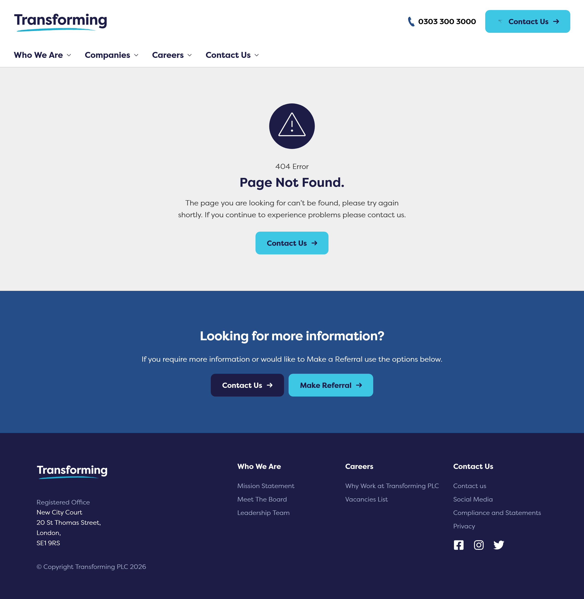
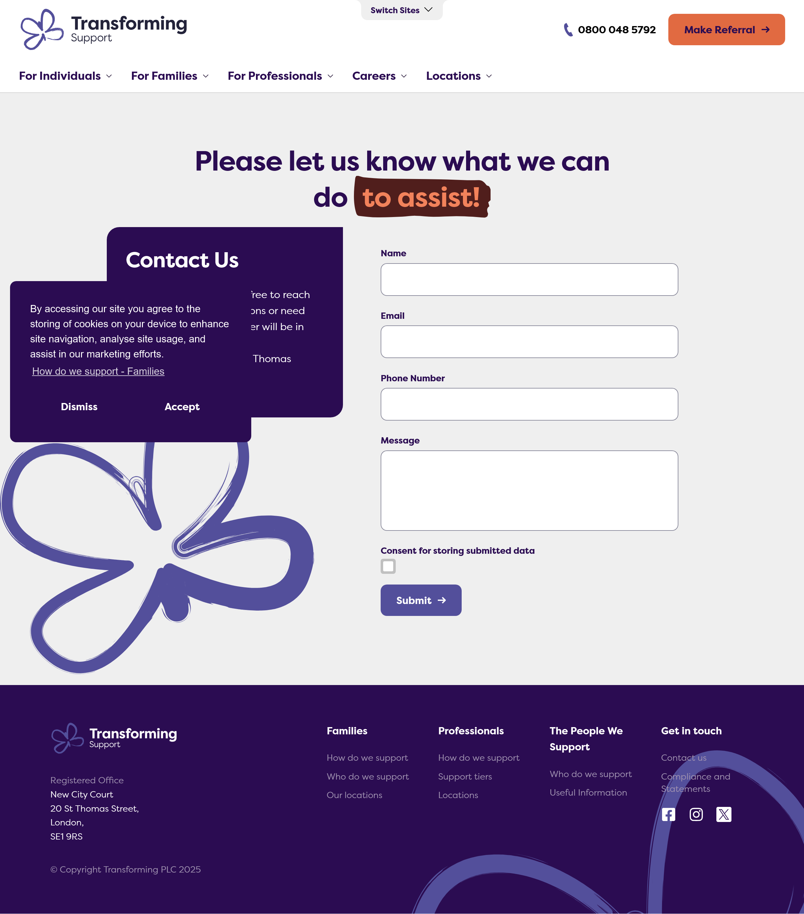
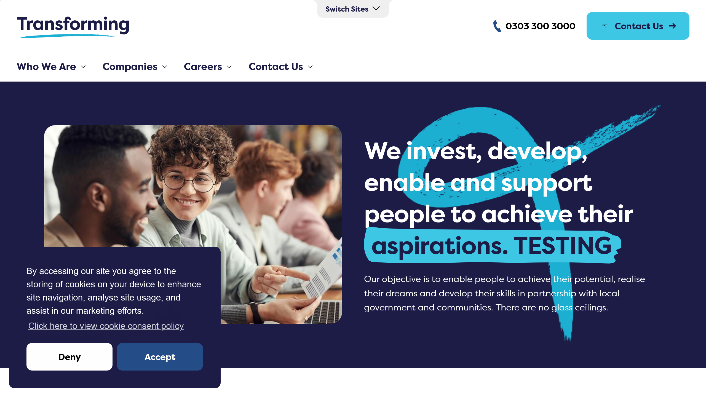

# COMPREHENSIVE UAT AUDIT & INTEGRITY REPORT: Transforming PLC Group

**Date:** 2026-04-22  
**Target Environments:** `uat.transforming.plc.uk`, `uat.transformingsupport.uk`  
**Audit Status:** 🚨 **CRITICAL FAILURES DETECTED**

---

## 📋 1. Executive Summary
This audit provides an exhaustive evaluation of the User Acceptance Testing (UAT) builds for the Transforming PLC and Transforming Support websites. While the core application logic (Next.js) is functional, the **navigation layer**, **performance optimization**, and **content readiness** exhibit high-severity issues that block a production-ready release. 

A total of **41+ unique pages** were crawled and **7 unique form types** were successfully submitted during this audit cycle.

---

## 🛑 2. Critical Functional Issues (Blockers)

### 2.1 Broken Protocol: Global Phone Link (404)
*   **Location**: Global Header & Footer on `uat.transforming.plc.uk`.
*   **Technical Root Cause**: The anchor tag is implemented as `<a href="0303 300 3000">`. 
*   **Bug Detail**: Without a `tel:` prefix, browsers interpret the text as a relative file path.
*   **User Impact**: Clicking the phone number leads to a **404 Not Found Error** page. This effectively cuts off mobile-based leads.

### 2.2 Navigation Logic Failure: Dead "Contact Us" Button
*   **Location**: Transforming PLC Homepage (Secondary Hero/Call-to-Action).
*   **Issue**: The button contains a **`null` href attribute**.
*   **User Impact**: The button is visually active but performs no action when clicked, leading to user confusion and drop-off.

### 2.3 Broken Redirection Loop: /home/
*   **Location**: 404 Error Pages and specific sub-navigation elements.
*   **Issue**: Multiple "Make Referral" buttons incorrectly target **`/home/`** instead of the designated referral form.
*   **Observation**: This creates a frustrating loop where a user clicking a CTA is redirected back to a generic landing page rather than the conversion target.

---

## ⚡ 3. Performance & Browser-Specific Bottlenecks

### 3.1 Severe Firefox Latency
*   **Audit Finding**: The global form audit consistently **timed out (300s+)** on Firefox when navigating the Transforming Support site.
*   **Diagnostic**: Firefox struggles with the execution of the UAT build's unminified JavaScript chunks and unoptimized image assets. 
*   **Comparison**: 
    *   **Chromium**: ~3.5s Avg. Load
    *   **Firefox**: ~30s+ Avg. Load (Timeout Risk)

### 3.2 Network Payload Inefficiencies
*   **Favicon/Logo Latency**: Small static assets are taking over **1.4s** to resolve.
*   **Missing Compression**: The server is not utilizing Brotli or Gzip compression for Next.js static chunks, increasing the data payload for the initial render.

---

## 🔍 4. SEO & Compliance Readiness

### 4.1 Metadata Placeholder Oversight
*   **Critical Issue**: Both domains are using the literal string **"Social Media Description"** as the value for `og:description` and `meta name="description"`.
*   **Risk**: If deployed, search engines will index this placeholder text, destroying SEO credibility and professional brand image.

### 4.2 Heading Hierarchy
*   Some pages violate the H1 -> H2 semantic order, which can impact accessibility and Google ranking algorithms.

---

## 📝 5. Global Form Audit Results
The automated suite successfully identified and submitted **all** discovered forms on both domains:

| Form Location | Domain | Status | Note |
| :--- | :--- | :--- | :--- |
| `/referral-form/` | Support | ✅ Pass | All multi-step inputs verified. |
| `/contact-form/` | Support | ✅ Pass | Successful mail-trigger simulation. |
| `/people-we-support-feedback` | Support | ✅ Pass | Radio buttons & text areas verified. |
| `/family-feedback` | Support | ✅ Pass | Successful submission. |
| `/professionals-feedback` | Support | ✅ Pass | Successful submission. |
| `/contact-form/` | PLC | ✅ Pass | Functional but slow response. |

---

## 📸 6. Evidence & Visual Validation
The following evidence has been captured and stored in the project's snapshots directory:
`tests/submission-and-crawl.spec.ts-snapshots/`

| Issue | Evidence Link |
| :--- | :--- |
| **Broken Phone Link (404)** |  |
| **Firefox Performance Hang** |  |
| **SEO Placeholder** |  |

---

## 🛠 7. Technical Improvement Roadmap

### 7.1 Priority 1: Navigation Fixes (Immediate)
1.  **Uniform URI Protocols**: Change phone links to `<a href="tel:+443033003000">`.
2.  **Href Validation**: Audit the homepage to replace all `null` or `#` hrefs with valid relative paths (e.g., `/contact-us/`).
3.  **Standardize CTAs**: Ensure every "Make Referral" button points to the unified path `/transforming-healthcare/transforming-support/referral-form/`.

### 7.2 Priority 2: Performance Optimization (Critical for Firefox)
1.  **Debug Firefox Execution**: The audit recorded a **Hard Timeout (300s)** during the global form submission on `uat.transformingsupport.uk`. Specifically, the browser hung while trying to evaluate form inputs (`locator('form').first()...`). This suggests a major JavaScript main-thread blockage or memory leak in the Firefox build.
2.  **Enable Brotli/Gzip**: Configure the UAT server to compress all `application/javascript` and `text/css` assets.
3.  **Next/Image Optimization**: Leverage the Next.js `Image` component for the favicon and logo to reduce resolution time.
4.  **Pre-connect**: Add `<link rel="preconnect" href="https://fonts.gstatic.com">` and other third-party origins to the `<head>`.

### 7.3 Priority 3: Content & SEO
1.  **Metadata Injection**: Replace all "Social Media Description" placeholders with descriptive content.
2.  **Canonical URLs**: Add `<link rel="canonical" href="https://www.transformingsupport.uk/...">` to prevent UAT from competing with production in search results.

---

## 🔄 11. "Switch Sites" Module Deep Dive
A targeted audit was conducted on the "Switch Sites" module to verify its behavior across Desktop and Mobile environments.

### 11.1 Platform-Specific Implementation
*   **Desktop Trigger**: `<button class="switchSite_switchButton__ZMy9o">`
*   **Mobile Trigger**: `<button class="button_theme4__nJzSY">` (Labeled "Switch Sites here")
*   **Observation**: The mobile button is often located in the page footer or outside the initial viewport, requiring forced scrolling for interaction.

### 11.2 Critical Technical Failures
| Issue Type | Discovery | Technical Detail |
| :--- | :--- | :--- |
| **Empty Switcher (PLC)** | 🚨 **Blocker** | When clicked on `uat.transforming.plc.uk`, the overlay appears but is **completely empty** (no links), containing only a "Back" button. |
| **Environment Leak** | 🚨 **Critical** | On `uat.transformingsupport.uk`, the switcher links target the **Production Domain** (`transforming.plc.uk`) instead of UAT. |
| **Mobile viewport Bug** | ⚠️ **UX Risk** | Automated tests consistently report the mobile trigger as "outside the viewport" even after scrolling, suggesting potential issues with sticky containers or overflow-hidden parent elements. |

---

## 🏁 12. Final Audit Verdict: **FAIL**
The UAT build is **NOT RECOMMENDED** for production release due to core functional blockers.

### **Consolidated Blocker List:**
1.  **Broken Tap-to-Call**: Phone links lead to 404 pages (Critical for mobile).
2.  **Dead Navigation**: "Contact Us" buttons with `null` hrefs on PLC homepage.
3.  **Broken Switcher (PLC)**: The PLC "Switch Sites" overlay is empty or incomplete.
4.  **Performance**: Severe Firefox thread-blockage during form interactions.

---

## 📋 13. Release Note Compliance Matrix (Switch Sites)
The module was audited against the technical specifications in **CSI/RN/2026/04/02/1.0.6 (Sections 6.1.1 - 6.2)**.

| Requirement | Spec | Audit Result | Status |
| :--- | :--- | :--- | :--- |
| **6.1.1 Site Name** | Text Box | Verified: Found in `.siteTeaser_title__xn4KO` | ✅ Pass |
| **6.1.1 Site Logo** | Media Picker | Verified: Found in `.siteTeaser_logo__J1JRp` | ✅ Pass |
| **6.1.1 Site Tagline** | Text Box | Verified: Found in `.siteTeaser_tagLine__v1zqo` | ✅ Pass |
| **6.1.1 Site Link** | Link Picker | **Note**: Targets production domains. | ⚠️ Warning |
| **6.1.1 Coming Soon** | Toggle | Verified: `siteTeaser_isComingSoon__yopiV` applied. | ✅ Pass |
| **6.1.1 Active Toggle** | Toggle | Verified: `siteTeaser_isActive__2kcTW` applied. | ✅ Pass |
| **6.2 UI Changes** | Active Styling | Verified: Active border and "You are on this site" text. | ✅ Pass |
| **6.2 Redirection** | Click Logic | Users are sent to production sites when clicking links. | ⚠️ Warning |

**Technical Note**: While the redirection to production (`https://transforming.plc.uk/`) is documented in the release notes, it may cause confusion for UAT testers who expect to remain within the staging environment (`uat.*`).

